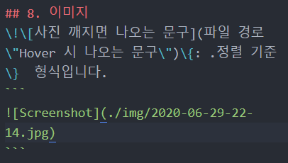

---

title: "마크다운 문법" excerpt: ""

categories: - Editor tags: - Markdown

last_modified_at: 2020-06-29T21:35:00
-------------------------------------

마크다운 문법을 연습할 겸, 써 뒀다가 두고두고 볼 겸 해서 글로 따로 작성해두려고 합니다.

1.	텍스트 ---------

문단을 나누려면 Enter를 두 번 치면 됩니다.  
줄바꿈을 하려면 whitespace 2개 + Enter 한 번 이 필요합니다.

*asterisk 한 개* 를 양 옆으로 붙이면 이텔릭 체가 되고, **asterisk 두 개** 를 양 옆으로 붙이면 Bold체가 됩니다. ***asterisk 세 개*** 를 양 옆으로 붙이면 Bold + Itelic을 만들 수 있습니다. ~~물결 두 개~~ 로 취소선을 만들 수 있습니다. ~~**볼드 취소**~~ 처럼 쓸 수도 있습니다.

---

1.	헤더 -------

HTML의 <hN>처럼 여러 개의 글 머리(헤더)가 있습니다.  
#H1 # 한 개  
##H2 # 두 개 ###H3 # 세 개 ####H4 # 네 개 #####H5 # 다섯 개 ######H6 # 여섯 개

---

1.	인용 -------

> '>' 블럭 인용 문자를 씁니다. > 여러 번 쓰면 이렇게도 됩니다.

---

1.	(un)ordered list ----------------
2.	ordered list는

3.	그냥

4.	'1. 2. 3. 4.' 를

5.	순서대로 쓰면 됩니다.

6.	unordered list는

	-	Indent를 하면서
	-	Asterisk를 쓰면 됩니다.

7.	\* 뿐 아니라

	-	\+ 도 되고
	-	\- 도 됩니다.

---

1.	코드 인용 ------------

ESC 밑의 \` 를 앞 뒤로 붙입니다.

```html
function test() {
  console.log("```를 코드 앞 뒤로 붙이세요!");
}
```

\`\`\` 뒤에 언어 이름을 써주면 문법에 맞게 하이라이트도 됩니다.`c
int main(){
  printf("Hello world!");
}
`

---

1.	분기선 ---------

\-를 세 개 이상 쓰면 됩니다. 몇 개를 써도 똑같은 분기선이 그려집니다.

---

1.	링크 -------

\[Title](link) 형식으로 씁니다.

[내 일상 블로그](https://blog.naver.com/mung3477)

\< \> 로 묶어서 주소만 표현할 수도 있습니다.https://google.com

---

1.	이미지 ---------

!\[사진 깨지면 나오는 문구](\"파일 경로\") 형식입니다.`

` 

파일은 깃헙 프로젝트에 img 폴더를 만들어서 거기다 쌓으면서 쓰는 편이라고 합니다... 추후에 필요에 따라 폴더를 분류할 지도.

---

1.	표 -----

```
| 항목 | 가격 | 개수 |
|:---:|:----:|:----|
| 라면 | 800원 | 10개 |
| 과자 | 900원 | 20개 |
```

| 항목 | 가격  | 개수 |
|:----:|:-----:|:-----|
| 라면 | 800원 | 10개 |
| 과자 | 900원 | 20개 |

\- 의 개수로 칸 수를 정합니다.

---

끝!
